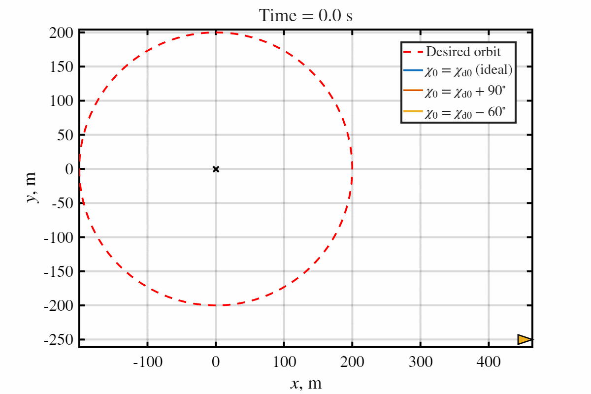
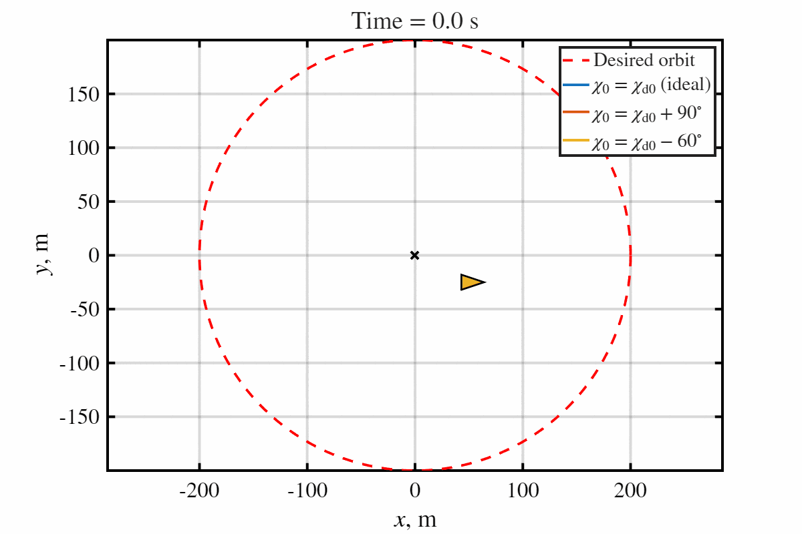

# GLASS Guidance for Enclosed Inspection Using UAV

This repository contains MATLAB simulations and demonstration results for:

> Amit Shivam, Manuel C.R.M. Fernandes, Sérgio Vinha, and Fernando A.C.C. Fontes  
> **Geometric Look-Angle Shaping Strategy for Enclosed Inspection**

---

## Overview

GLASS is a geometry-driven look-angle shaping guidance strategy for UAV enclosed inspection and standoff tracking under turn-rate constraints.

The method uses a hyperbolic-tangent shaping function encapsulating polar engagement geometry to regulate radial convergence while preserving curvature feasibility.

---

## Key Contributions

- Bounded geometric look-angle shaping
- No far-field feasibility limitation of arcsine shaping
- Global well-posedness of guidance dynamics
- Lyapunov-based asymptotic convergence
- Closed-form tube-entry time
- Turn-rate constrained guidance design
- 6DOF quadrotor simulation validation

---

## Representative Results

<table>
<tr>
<td align="center" width="50%">
<h3>GLASS Guidance: Outside Initial Condition</h3>

<br>
<p>Far-field capture from outside the desired standoff orbit using bounded look-angle shaping.</p>
</td>

<td align="center" width="50%">
<h3>GLASS Guidance: Inside Initial Condition</h3>

<br>
<p>Orbit acquisition from inside the desired standoff boundary with smooth radial convergence.</p>
</td>
</tr>
</table>
---

## Repository Structure

```text
paper/      -> GLASS paper
figures/    -> plots and GIF demonstrations
matlab/     -> MATLAB simulation scripts 

## Citation

```bibtex
@inproceedings{shivam2026glass,
  title={Geometric Look-Angle Shaping Strategy for Enclosed Inspection},
  author={Shivam, Amit and Fernandes, Manuel and Vinha, Sergio and Fontes, Fernando},
  booktitle={International Conference on Unmanned Aircraft Systems},
  year={2026}
}
```

